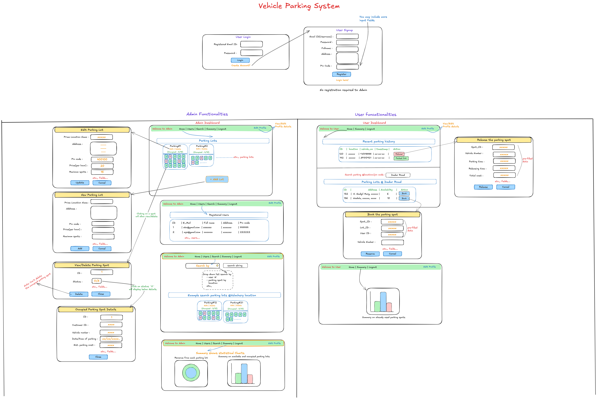

# 🚗 Vehicle Parking App (VPA)

A multi-user vehicle parking management system built with Flask, SQLite, and Bootstrap. This application enables **admins** to manage parking lots and **users** to book and release 4-wheeler parking spots with real-time updates.


---


## 📌 Academic Context

This project was developed as part of the **Modern Application Development I (MAD1)** course at **IIT Madras**.  

✅ Achieved an **S grade** for this project.

---

## 🛠️ Tech Stack

- **Backend:** Flask
- **Templating Engine:** Jinja2
- **Frontend:** HTML, CSS, Bootstrap
- **Database:** SQLite (created programmatically)

---

## ✨ Features

### 👨‍💼 Admin Functionalities
- **Admin Dashboard**:  
  View all existing parking lots in one place with a clear summary of occupied and available spots.
  
- **Add Parking Lots**:  
  Create a new parking lot by entering details such as:
  - Location name  
  - Address  
  - Pin code  
  - Total capacity  

- **Edit / Delete Parking Lots**:  
  Update lot details or remove a lot entirely (only possible if no spots are occupied).

- **Manage Parking Spots**:  
  View each parking spot inside a lot with color-coded status:  
  - 🟢 **Available** (Green)  
  - 🔴 **Occupied** (Red)  

- **Delete Spots**:  
  Remove individual spots (only if they are free).

- **View Registered Users**:  
  See details of all users who have registered:
  - ID, Email, Full Name, DOB, Address  

- **Search Users**:  
  Find users by email or name.

- **Admin Summary**:  
  - Visual charts (Bar + Pie) showing overall parking usage statistics.  
  - Insights into how many lots and spots are active/occupied.

- **Profile Management**:  
  Admins can edit their own details.

---

### 👤 User Functionalities
- **User Registration & Login**:  
  Create an account with basic details (name, email, DOB, address, etc.) and log in securely.

- **User Dashboard**:  
  Overview of:
  - Parking history  
  - Available lots  
  - Recently booked spots  

- **Search Parking Lots**:  
  Look for parking lots by location or pin code.  

- **Book a Spot**:  
  Reserve a parking spot in a chosen lot by providing:
  - Spot ID  
  - Lot ID  
  - Vehicle number  

- **Release Spot**:  
  Free up a reserved spot once done.

- **View Occupied Spots**:  
  Check details of currently occupied spots.

- **User Summary**:  
  - View statistics of personal parking activity.  
  - Graphical representation of booked vs released spots.

- **Profile Management**:  
  Edit personal information like email, name, DOB, and address.


---
## ⚙️ Installation & Setup

###  1. Clone the repository  
   ```bash
   git clone https://github.com/Chaudhary-IIT/VPA.git
   cd vehicle-parking-app
   ```
###  2. Create and activate virtual environment
   ```bash
    python -m venv venv
    venv\Scripts\activate
```
### 3. Install Dependencies 
   ```bash
   pip install -r requirements.txt
```

### 4. Run the app.py 
```
Admin's Username: admin@user.com
Password: 1234
```
---
## 📁 Folder Structure
```
VPA:
│   .gitignore
│   app.py
│   Project Documentation.pdf
│   README.md
│   requirements.txt
│
├───application
│   ├── controllers.py
│   ├── database.py
│   └── models.py
│
├───instance
│   └── parking.sqlite3
│
├───static
│   │  ├── 2.jpg
│   │  ├── admin_1.png
│   │  ├── admin_2.png
│   │  ├── admin_bar.png
│   │  ├── admin_pie.png
│   │  ├── basic.css
│   │  ├── dashboard.css
│   │  ├── form.css
│   │  ├── register.css
│   │  ├── user_bar.png
│   │  ├── user_bar2.png
│   │  └── user_pie.png
│   │
│   └───Screenshot
│       ├── Screenshot (664).png
│       ├── Screenshot (665).png
│       ├── Screenshot (666).png
│       ├──  Screenshot (667).png
│       ├──  Screenshot (668).png
│       ├──  Screenshot (669).png
│       ├──  Screenshot (670).png
│       ├──  Screenshot (671).png
│       ├──  Screenshot (672).png
│       ├──  Screenshot (673).png
│       ├──  Screenshot (675).png
│       ├──  Screenshot (676).png
│       ├──  Screenshot (677).png
│       ├── Screenshot (678).png
│       ├── Screenshot (679).png
│       └── Screenshot (680).png
│
└───templates
    ├── admin_dashboard.html
    ├── admin_dashboard2.html
    ├── admin_search.html
    ├── admin_summary.html
    ├── book_spot.html
    ├── delete_spot.html
    ├── edit_lot.html
    ├── edit_profile.html
    ├── login.html
    ├── new_lot.html
    ├── occupied_spot.html
    ├── register.html
    ├── release_spot.html
    ├── search_results.html
    ├── user_dashboard.html
    ├── user_dashboard2.html
    └── user_summary.html
```
---

## UI Wireframe Flow




---

## 📸 Screenshots

### Login Page
.png)

### Register Page
.png)

### 🏠 Admin 

#### Dashboard
.png)

#### User Details
.png)

#### Search User
.png)

#### Search Parking Lot
.png)

#### Admin Summary
.png)

##### Revenue Breakdown
.png)

#### User Dashboard
.png)

#### Parking Lot Search for User
.png)

#### User Summary
.png)

#### Edit Profile
.png)

#### Edit Parking Lot
.png)

#### New Parking Lot
.png)

#### Delete a Parking Spot
.png)

#### Occupied Parking Spot
.png)
